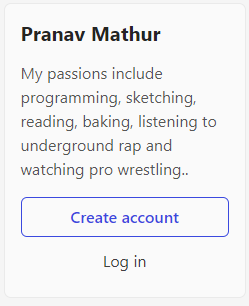

# Dom Manipulation Assignment

1. Webiste Name: [Dev To](https://dev.to/)

### Topics

    - Query Selctory, Inner HTML

### Sample Image

### Tasks

        Target the Top description div and change the DEV Community to <Your_Name> and description to your passion

### Solution

> `document.querySelector("aside h2").innerHTML = "Pranav Mathur";`
>
> `document.querySelector("aside p").innerHTML = "My passions include programming, sketching, reading, baking, listening to underground rap and watching pro wrestling..";`

### Output

2. Website Name: [Apple](https://support.apple.com/en-in)

### Task

### Fetch all the product name and store in an array

### Solution

> `const arr = [];`
>
> `for(let i=0; i<document.querySelectorAll(".as-imagegrid .as-imagegrid-item-title").length; i++){arr.push(document.querySelectorAll(".as-imagegrid .as-imagegrid-item-title")[i].innerText)}`
>
> `const arr2 = [];`
>
> `for(let i=0; i<arr.length; i++){arr2[i] = arr[i].replace("\nSupport", "")}`
>
> `console.log(arr2);`

### Output

['iPhone', 'Mac', 'iPad', 'Watch', 'AirPods', 'Music', 'TV']

3. Webiste Name: [Youtube Support](https://support.google.com/youtube/)

### Topics

    - Get Element By Id, Create Element, Create Text Node, Append Child

### Sample Image

### Tasks

     Add another FAQ 'My New FAQ' to the list

### Solution

> `let node = document.createElement("section");`
>
> `node.setAttribute("class", "parent");`
>
> `document.querySelector("#hcfe-content .accordion-homepage").appendChild(node);`
>
> `document.querySelectorAll("#hcfe-content .accordion-homepage .parent")[8].innerHTML = '<h3>My New FAQ</h3>';`

### Output

4. Webiste Name: [OnePlus](https://www.oneplus.in/support)

### Topics

     Query Selector, InnerText

### Sample Image

### Tasks

      Change the contact number

### Solution

> `document.querySelector(".contactUs--item .item--subtitle").innerText = "1234 567 8901"`

### Output

5. Webiste Name: [Samsung](https://www.samsung.com/in/offer/online/samsung-fest/)

### Topics

       getElementById, createElement, InnerText, append, setAttribute

### Sample Image

### Tasks

     Target the main div of card and change the Button text to Check out

### Output

6. Webiste Name: [Adidas](https://www.adidas.co.in/)

### Topics

    -   Query Selector, Event listeners, Changing Styles

### Sample Image

### Tasks

     Target the search box and on hover change thebackground color to red.

### Output

7. Webiste Name: [MDN Web Docs](https://developer.mozilla.org/en-US/)

### Topics

       Form, Value, Submit

### Sample Image

### Tasks

     To Search a topic in the MDN Search bar.
     First add a text to search in the search bar and then hit the submit search button to search the docs using DOM

### Output

8. Webiste Name: [Google](https://www.google.com/)

### Topics

       Remove Elements

### Sample Image

### Tasks

     Remove alternate languages from the home page languages listed

### Output

9. Webiste Name: [Code Wars](https://www.codewars.com/)

### Topics

       Change Font Family, Color of Text.

### Sample Image

### Tasks

    Change the font family of the text to monospace and text color to the logo’s background color.

### Solution

> `document.querySelector(".display-heading-1").style.fontFamily = "monospace"`
>
> `document.querySelector(".display-heading-1").style.color = "#b1361e"`

### Output

10. Webiste Name: [Freecodecamp](https://www.freecodecamp.org/)

### Topics

       querySelector, mouseover, click eventListener,  callback function, style,

### Sample Image

### Tasks

    Target the button and change background colour on mouseover

### Output

11. Webiste Name: [realme](https://www.realme.com/in/)

### Topics

       querySelector,style,background-image

### Sample Image

### Tasks

    change the realme logo to ineuron logo

### Solution

> `document.querySelector(".wrapper .icon-logo").style.backgroundImage = "url(https://learn.ineuron.ai/_next/image?url=%2Fimages%2Fineuron-logo.png&w=750&q=75)"`

### Output

12. Webiste Name: [Github](https://github.com/)

### Topics

       querySelector,style,background-Color

### Sample Image

### Tasks

     change the background colour of the button to blue.

### Solution

> `document.querySelector("section form button").style.backgroundColor = "blue"`

### Output

13. Webiste Name: [Hackerrank](https://www.hackerrank.com/)

### Topics

       querySelector,innerHtml

### Sample Image

### Tasks

Target the top description and change “Matching developers with great companies” to ‘JSBOOTCAMP“.

### Solution

> `document.querySelector(".content-area .fl-heading-text").innerHTML = "JSBOOTCAMP"`

### Output

14. Webiste Name: [Asus](https://www.asus.com/in/)

### Topics

      querySelector,style,font-size

### Sample Image

### Tasks

       change the fontsize of “Hot Deals” to 80px

### Solution

> `document.querySelector(".HotDealsAll__Heading__2fIbe").style.fontSize = "80px"`

### Output

15. Webiste Name: [Dell](https://www.dell.com/en-in/shop/deals/laptop-deals?gacd=10415953-9016-5761040-285981356-0&dgc=ST&gclid=Cj0KCQjwguGYBhDRARIsAHgRm4-XUDMhhVNyHXb3s1gY4ZBzORr_d9Se-buhJwy7asyUe7YdqEA11eEaAt6UEALw_wcB&gclsrc=aw.ds&nclid=BxjBlpBQsX6pjSHh-L8YYSU77EpfXRkG1AGMB5Wbeu386ykspfrPDnfx_DdFau20)

### Topics

      querySelector,style.textAlign

### Sample Image

### Tasks

       Convert the text “G15 Gaming Laptop” from left to right

### Solution

> `document.querySelector("#d560822win9b .ps-top .ps-title").style.textAlign = "right"`

### Output

16. Webiste Name: [Vercel](https://vercel.com/)

### Topics

     querySelector,innerHTMl

### Sample Image

### Tasks

      change the heading “Start with the developer” to “Start with Scratch”

### Solution

> `document.querySelector(".geist-wrapper .geist-container h4").innerText = "Start with Scratch"`

### Output

17. Webiste Name: [Sony](https://www.sony.co.in/)

### Topics

    querySelector,innerHTMl

### Sample Image

### Tasks

     change the button text To current Date.

### Solution

> `let d = Date();`
>
> `document.querySelector("#product_summary_default .span4 .btn-container").innerHTML = d`

### Output

18. Webiste Name: [Philips](https://www.philips.co.in/)

### Topics

     querySelector,style,backgroundcolor

### Sample Image

### Tasks

    change the background colour blue to orange

### Solution

> `document.querySelector("footer").style.background = "orange"`

### Output

19. Webiste Name: [Canon](https://in.canon/)

### Topics

          querySelector,src

### Sample Image

### Tasks

    extract the canon logo

### Solution

> `let extraction = document.querySelector(".navbar-header img").src`
>
> `let anchor = '<a href="' + extraction + '">' + extraction + '</a>'`
>
> `document.querySelector(".navbar-header").innerHTML = anchor`

### Output

20. Webiste Name: [Oppo](https://www.oppo.com/in/)

### Topics

          querySelector,style,color

### Sample Image

### Tasks

      Change the description colour black to orange

### Solution

> `document.querySelector(".section-box .desc").style.color = "orange"`

### Output

